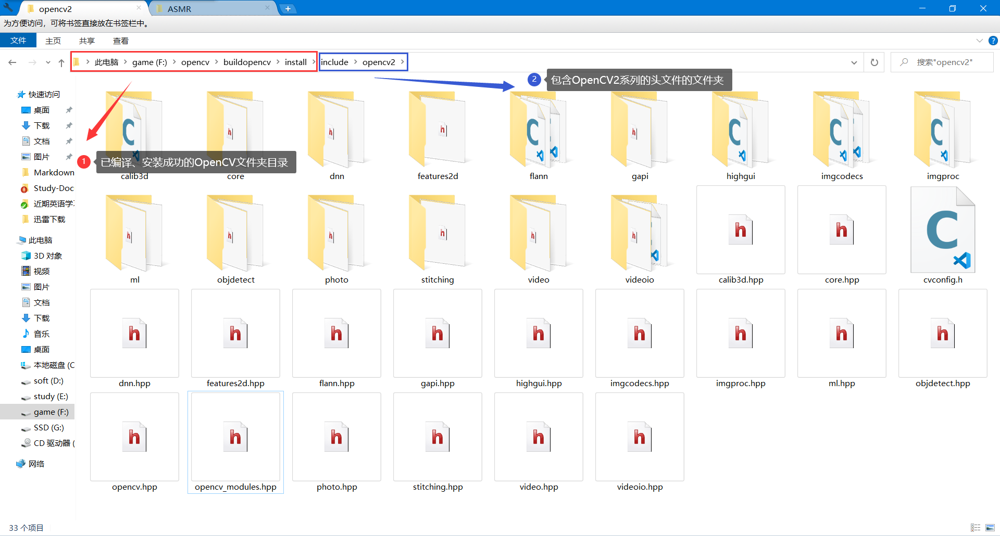
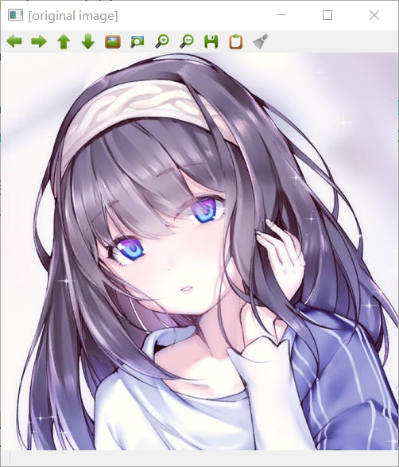
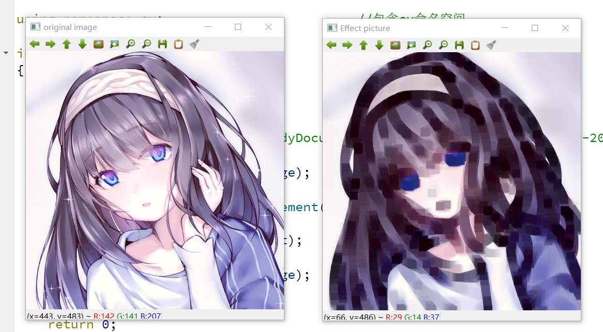

# 邂逅OpenCV

[toc]
## 前言

>**笔记系列**
>
>**参考书籍：OpenCV3编程入门**
>
>**作者：毛星云**
>
>**版权方：电子工业出版社**
>
>**出版日期：2015-02**
>
>**笔记仅供本人参考使用，不具备共通性**
>
>**笔记中代码均是OpenCV+Qt的代码，并非用vs开发，请勿混淆**

## 1.1 OpenCV周边概念认知

### 1.1.1 图像处理、计算机视觉与OpenCV

+ 图像处理
  + Image Processing
  + 计算机对图像进行分析，以达到所需结果的技术，又称影像处理
  + 该技术包括
    + 图像压缩、增强和复原
    + 图像匹配、描述
    + 图像识别
  + 一般指数字图像处理(Digital Image Processing)
    + 数字图像是一个大的二维数组
      + 数组元素称为像素
      + 数组值称为灰度
    + 处理是指对数字图像进行
      + 去除噪声
      + 增强
      + 复原
      + 分割
      + 提取特征
  + **<font color=red>侧重于“处理”图像</font>**
  
+ 计算机视觉
  + Computer Vision
  + 用设备代替人眼对目标进行识别、跟踪和测量等机器视觉，并进一步做图形处理
  + **<font color=red>侧重于使用计算机来模拟人的视觉</font>**
  
+ OpenCV

  + Open Source Computer Vision Library

  + 一款基于开源发行的跨平台计算机视觉库

  + 实现了图像处理和计算机视觉发面的很多通用算法

### 1.1.2 OpenCV概述

+ Open Source Computer Vision Library
+ 开源计算机视觉库
+ 跨平台
+ 设计目标
  + 执行速度尽量快
  + 关注实时应用
+ 采用优化的C/C++代码编写
+ 能够多核处理
+ 提供MLL(Machine Learning Library)机器学习库

### 1.1.3 起源及发展

+ 略

### 1.1.4 应用概述

+ 人机交互
+ 物体识别
+ 图像分区
+ 人脸识别
+ 动作识别
+ 运动跟踪
+ 机器人

## 1.2 OpenCV基本架构分析

**初学OpenCV时，先了解一下OpenCV的整体模块架构，再重点学习和突破自己感兴趣的部分，就会有得心应手，一览众山小的学习体验**

**<font color=red size=5>通过OpenCV安装路径下include目录里面头文件的分类存放，来略读一下它的庞杂组织架构</font>**

进入到`...\opencv\build\include\opencv2`目录



**<font color=blue size=4>在该目录中，找到`opencv_modules.hpp`的hpp文件</font>**

**<font color=blue size=4>该文件中存放的是OpenCV2中与新模块构造相关的说明代码：</font>**

```c++
/*
 *      ** File generated automatically, do not modify **
 *		**				文件自动生成，请勿修改				**
 *
 * This file defines the list of modules available in current build configuration
 *
 * 该文件定义了当前构建配置中可用的模块列表
 *
*/

// This definition means that OpenCV is built with enabled non-free code.
// 这个定义意味着OpenCV是用启用的非自由代码构建的
// For example, patented algorithms for non-profit/non-commercial use only.
// 例如，专利算法只能用于非营利/非商业用途。
/* #undef OPENCV_ENABLE_NONFREE */

#define HAVE_OPENCV_CALIB3D
#define HAVE_OPENCV_CORE
#define HAVE_OPENCV_DNN
#define HAVE_OPENCV_FEATURES2D
#define HAVE_OPENCV_FLANN
#define HAVE_OPENCV_GAPI
#define HAVE_OPENCV_HIGHGUI
#define HAVE_OPENCV_IMGCODECS
#define HAVE_OPENCV_IMGPROC
#define HAVE_OPENCV_ML
#define HAVE_OPENCV_OBJDETECT
#define HAVE_OPENCV_PHOTO
#define HAVE_OPENCV_STITCHING
#define HAVE_OPENCV_VIDEO
#define HAVE_OPENCV_VIDEOIO
```

如上，L17~L31就是OpenCV的所有模块，按照宏定义的顺序依次介绍

+ HAVE_OPENCV_CALIB3D  ----  <font color=blue>calib3d</font>
  + Calibration(校准)和3D这两个词的组合缩写
  + 该模块主要是相机校准和三维重建相关的内容
  + 算法包括
    + 多视角几何算法
    + 单个立体摄像头标定
    + 物体姿态估计
    + 立体相似性算法
    + 3D信息的重建
    + ……
+ HAVE_OPENCV_CORE  ----  <font color=blue>core</font>
  + 核心功能模块
  + 包含如下内容
    + OpenCV基本数据结构
    + 动态数据结构 
    + 绘图函数
    + 数组操作相关函数
    + 辅助功能与系统函数和宏
    + 与OpenGL的互操作
+ HAVE_OPENCV_DNN  ----  <font color=blue>dnn</font>
  + Deep Neural Network
  + 深层神经网络模块
  + <font color=green>详细内容暂略</font>
+ HAVE_OPENCV_FEATURES2D  ----  <font color=blue>features2d</font>
  + 即Features2D
  + 2D功能框架
  + 包含内容如下
    + 特征检测和描述
    + 特征检测器通用接口
    + 描述符提取器通用接口
    + 描述符匹配器通用接口
    + 通用描述符匹配器通用接口
    + 关键点绘制函数和匹配功能绘制函数
+ HAVE_OPENCV_FLANN  ----  <font color=blue>flann</font>
  + Fast Library for Approximate Nearest Neighbors
  + 高位的近似近邻快速搜索算法库
  + 包含内容如下
    + 快速近似最近邻搜索
    + 聚类
+ HAVE_OPENCV_GAPI  ----  <font color=blue>gapi</font>
  + G-API（Graph API） - 超高效图像处理 pipeline 引擎已集成为[opencv_gapi](https://github.com/opencv/opencv/tree/master/modules/gapi)模块
  + 这是一个新的 API，允许在流水线级别上对图像处理/CV 算法进行卸载和优化。
  + <font color=green>详细内容暂略</font>
+ HAVE_OPENCV_HIGHGUI  ----  <font color=blue>highgui</font>
  + 高层GUI图形用户界面
  + 包含媒体的输入输出、视频捕捉、图像和视频的编码解码、图形交互界面的接口等内容
+ HAVE_OPENCV_IMGCODECS
+ define HAVE_OPENCV_IMGPROC
+ HAVE_OPENCV_ML  ----  <font color=blue>ml</font>
  + Machine Learning
  + 机器学习模块
  + 基本上是统计模型和分类算法
  + 包含如下内容：
    + 统计模型
    + 一般贝叶斯分类器
    + K-近邻
    + 支持向量机
    + 决策树
    + 提升
    + 梯度提高树
    + 随机树
    + 超随机树
    + 期望最大化
    + 神经网路
    + MLData
+ HAVE_OPENCV_OBJDETECTL  ----  <font color=blue>objectect</font>
  + 目标检测模块
  + 包含Cascade Classification(级联分类)和Latent SVM两大部分
+ HAVE_OPENCV_PHOTO  ----  <font color=blue>photo</font>
  + Computational Photography
  + 包含图像修复和图像去噪两部分
+ HAVE_OPENCV_STITCHING  ----  <font color=blue>stitching</font>
  + images stitching
  + 图像拼接模块
  + 包含如下内容：
    + 拼接流水线
    + 特点寻找和匹配图像
    + 估计旋转
    + 自动校准
    + 图片歪斜
    + 接缝估测
    + 曝光补偿
    + 图片混合
+ HAVE_OPENCV_VIDEO  ----  <font color=blue>video</font>
  + 视频分析组件
  + 包括运动估计、背景分离、对象跟踪等视频处理相关内容
+ HAVE_OPENCV_VIDEOIO  ----  <font color=blue>videoio</font>
  + 视频输入输出组件
  + 主要是用来打开视频文件或者camera，输出对应文件/设备的流。

## 1.3 OpenCV3带来了什么

略

## 1.4 OpenCV的下载、安装与配置

此处主要提供Windows环境下Qt+Opencv的配置

转载文章：

[Qt-OpenCV开发环境搭建（史上最详细）](https://blog.csdn.net/Mr_robot_strange/article/details/110677323?ops_request_misc=%257B%2522request%255Fid%2522%253A%2522161378399316780271558682%2522%252C%2522scm%2522%253A%252220140713.130102334..%2522%257D&request_id=161378399316780271558682&biz_id=0&utm_medium=distribute.pc_search_result.none-task-blog-2~all~first_rank_v2~rank_v29-2-110677323.pc_search_result_hbase_insert&utm_term=qt-opencv)

[拜小白教你Qt5.8.0+OpenCV3.2.0配置教程(详细版)](https://blog.csdn.net/sinat_36264666/article/details/73200739?ops_request_misc=&request_id=&biz_id=102&utm_term=qt-opencv&utm_medium=distribute.pc_search_result.none-task-blog-2~all~sobaiduweb~default-0-73200739.pc_search_result_hbase_insert)

## 1.5 快速上手OpenCV图像处理

### 前期准备

在创建qt新项目后，需要在pro文件中添加如下代码，以能够使用OpenCV的库

```c++
//在pro文件的最后添加如下代码
INCLUDEPATH += F:\opencv\buildopencv\install\include\
               F:\opencv\buildopencv\install\include\opencv2\
               F:\opencv\buildopencv\install\include\opencv

LIBS += -L F:\opencv\buildopencv\install\x64\mingw\lib\libopencv_*.a

```


### 1.5.1 程序一 图像显示

在新版OpenCV中，图像显示过程非常简单，只需用`imread`函数载入到新版本的<font color = red>图像存储数据结构Mat类</font>中,然后用<font color = red>imshow</font>函数显示即可。

文件：<font color = blur size = 5>main.cpp</font>

```c++
#include "mainwindow.h"
#include <QApplication>
//上面两个是qt有的，暂时不理会

#include <opencv2/opencv.hpp>
using namespace cv;//包含cv命名空间

int main(int argc, char *argv[])
{
    QApplication a(argc, argv);
    //【1】载入图片
    Mat srcImage = imread("test.jpg");
    //图片要放在debug目录下，或者直接用完整的绝对地址，如下
    //Mat srcImage = imread("E:\\StudyDocuments\\Study-Documents-2021\\Year-2021\\Study_Note\\Qt\\Code\\opencv\\test.jpg");
    //【2】显示图像
    //此处不可显示中文，后期再寻解决之道
    imshow("[original image]",srcImage);
    //【3】等待任意键按下
    waitKey(0);
}

```



### 1.5.2 程序二 图像腐蚀

腐蚀，即用图像中的暗色部分“腐蚀”掉图像中的高亮部分

文件：<font color = blur size = 5>main.cpp</font>

```c++
#include "mainwindow.h"

#include <QApplication>

#include <opencv2/highgui/highgui.hpp>      //OpenCV highgui模块头文件
#include <opencv2/imgproc/imgproc.hpp>      //OpenCV 图像处理模块头文件

using namespace cv;                         //包含cv命名空间

int main(int argc, char *argv[])
{
    QApplication a(argc, argv);

    //【1】载入原图
    Mat srcImage = imread("E:\\StudyDocuments\\Study-Documents-2021\\Year-2021\\Study_Note\\Qt\\Code\\opencv\\test.jpeg");
    //【2】显示原图
    imshow("original image",srcImage);
    //【3】进行腐蚀操作
    Mat element = getStructuringElement(MORPH_RECT,Size(15,15));
    Mat dstImage;
    erode(srcImage,dstImage,element);
    //【4】显示效果图
    imshow("Effect picture",dstImage);
    waitKey(0);

    return 0;
}
```

程序首先载入和显示一幅原视图像(original image)

然后定义一个Mat类型的变量来获得`getStructuringElement函数`的返回值，即指定形状和尺寸的结构元素(内核矩阵)

接着调用`erode函数`进行图像腐蚀操作，最后调用`imshow函数`进行显示效果图(Effect picture)



### 1.5.3 程序三 图像模糊


### 1.5.4 程序四 canny边缘检测

## 1.6 OpenCV视频操作基础

### 1.6.1 读取并播放视频

### 1.6.2 调用摄像头采集图像

## 1.7 本章小结

