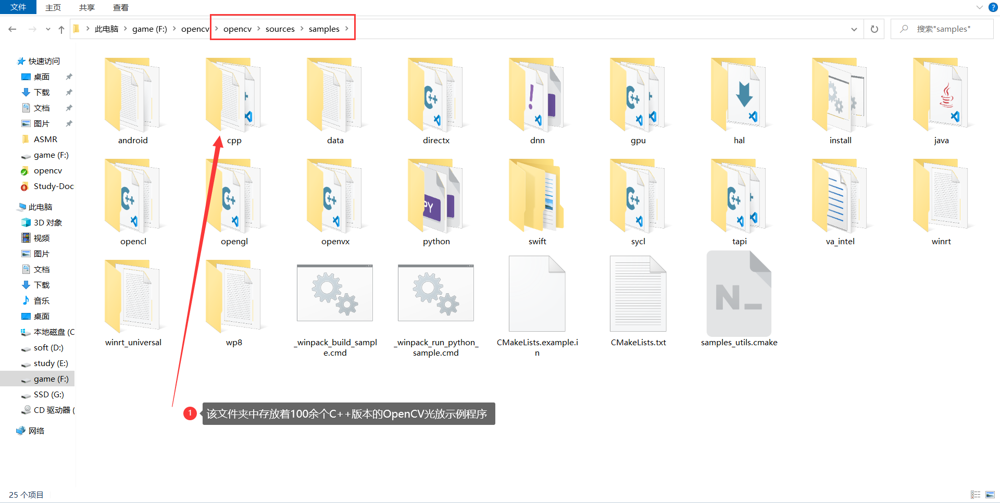
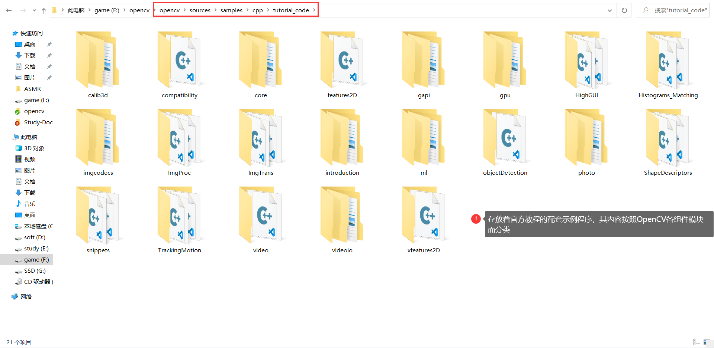
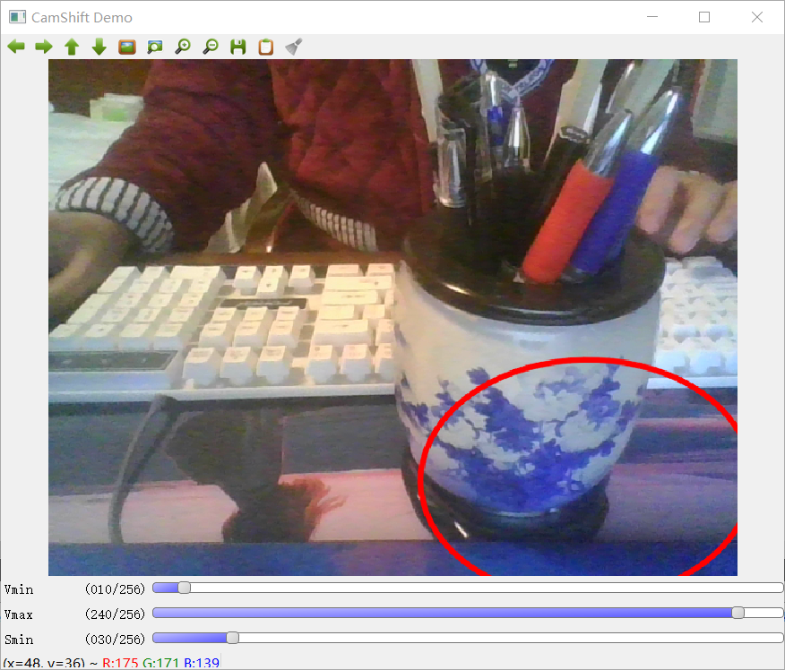
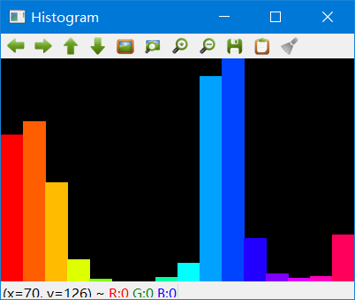

# 第二章 启程前的认知准备

[toc]

## 2.1 OpenCV官方例程引导与赏析

在OpenCV安装目录下，可以找到OpenCV官方提供的示例代码，具体位于

`...\opencv\sources\samples\cpp`



而在`...\opencv\sources\samples\cpp\tutorial_code`目录下，还存放着官方教程的配套示例程序。其内容按照OpenCV各组件模块而分类，非常适合学习，初学者可以按需查询，分类学习，各个击破。




### 2.1.1 彩色目标追踪：Camshift

该程序的用法是根据鼠标框选区域的色度光谱来进行摄像头读入的视频目标的追踪。

其主要采用CamShift算法（"Continuously Adaptive Mean-SHIFT"），它是对MeanShift算法的改进，被称为连续自适应的MeanShift算法。

示例程序在文件夹中的位置：`...\opencv\sources\samples\cpp\camshiftdemo.cpp`

使用Qt重新编译后如下

文件：<font color = blur size = 5>main.cpp</font>

```cpp
#include "mainwindow.h"
#include <QApplication>
#include "opencv2/core/utility.hpp"
#include "opencv2/video/tracking.hpp"
#include "opencv2/imgproc.hpp"
#include "opencv2/videoio.hpp"
#include "opencv2/highgui.hpp"
#include <QDebug>
#include <string.h>
#include <iostream>
#include <ctype.h>

using namespace cv;
using namespace std;

Mat image;

bool backprojMode = false;
bool selectObject = false;
int trackObject = 0;
bool showHist = true;
Point origin;
Rect selection;
int vmin = 10, vmax = 256, smin = 30;

// User draws box around object to track. This triggers CAMShift to start tracking
static void onMouse( int event, int x, int y, int, void* )
{
    if( selectObject )
    {
        selection.x = MIN(x, origin.x);
        selection.y = MIN(y, origin.y);
        selection.width = std::abs(x - origin.x);
        selection.height = std::abs(y - origin.y);

        selection &= Rect(0, 0, image.cols, image.rows);
    }

    switch( event )
    {
    case EVENT_LBUTTONDOWN:
        origin = Point(x,y);
        selection = Rect(x,y,0,0);
        selectObject = true;
        break;
    case EVENT_LBUTTONUP:
        selectObject = false;
        if( selection.width > 0 && selection.height > 0 )
            trackObject = -1;   // Set up CAMShift properties in main() loop
        break;
    }
}

string hot_keys =
    "\n\nHot keys: \n"
    "\tESC - quit the program\n"
    "\tc - stop the tracking\n"
    "\tb - switch to/from backprojection view\n"
    "\th - show/hide object histogram\n"
    "\tp - pause video\n"
    "To initialize tracking, select the object with mouse\n";

static void help(const char* argv)
{
    cout << "\nThis is a demo that shows mean-shift based tracking\n"
            "You select a color objects such as your face and it tracks it.\n"
            "This reads from video camera (0 by default, or the camera number the user enters\n"
            "Usage: \n\t";
    cout << argv[0] << " [camera number]\n";
    cout << hot_keys;
}

const char* keys =
{
    "{help h | | show help message}{@camera_number| 0 | camera number}"
};


int main(int argc, char *argv[])
{
    QApplication a(argc, argv);
    VideoCapture cap;
        Rect trackWindow;
        int hsize = 16;
        float hranges[] = {0,180};
        const float* phranges = hranges;
        CommandLineParser parser(argc, argv, keys);
        if (parser.has("help"))
        {
            help(*argv);
            return 0;
        }
        int camNum = parser.get<int>(0);
        cap.open(camNum);

        if( !cap.isOpened() )
        {
            help(*argv);
            cout << "***Could not initialize capturing...***\n";
            cout << "Current parameter's value: \n";
            parser.printMessage();
            return -1;
        }
        cout << hot_keys;
        namedWindow( "Histogram", 0 );
        namedWindow( "CamShift Demo", 0 );
        setMouseCallback( "CamShift Demo", onMouse, 0 );
        createTrackbar( "Vmin", "CamShift Demo", &vmin, 256, 0 );
        createTrackbar( "Vmax", "CamShift Demo", &vmax, 256, 0 );
        createTrackbar( "Smin", "CamShift Demo", &smin, 256, 0 );

        Mat frame, hsv, hue, mask, hist, histimg = Mat::zeros(200, 320, CV_8UC3), backproj;
        bool paused = false;

        for(;;)
        {
            if( !paused )
            {
                cap >> frame;
                if( frame.empty() )
                    break;
            }

            frame.copyTo(image);

            if( !paused )
            {
                cvtColor(image, hsv, COLOR_BGR2HSV);

                if( trackObject )
                {
                    int _vmin = vmin, _vmax = vmax;

                    inRange(hsv, Scalar(0, smin, MIN(_vmin,_vmax)),
                            Scalar(180, 256, MAX(_vmin, _vmax)), mask);
                    int ch[] = {0, 0};
                    hue.create(hsv.size(), hsv.depth());
                    mixChannels(&hsv, 1, &hue, 1, ch, 1);

                    if( trackObject < 0 )
                    {
                        // Object has been selected by user, set up CAMShift search properties once
                        Mat roi(hue, selection), maskroi(mask, selection);
                        calcHist(&roi, 1, 0, maskroi, hist, 1, &hsize, &phranges);
                        normalize(hist, hist, 0, 255, NORM_MINMAX);

                        trackWindow = selection;
                        trackObject = 1; // Don't set up again, unless user selects new ROI

                        histimg = Scalar::all(0);
                        int binW = histimg.cols / hsize;
                        Mat buf(1, hsize, CV_8UC3);
                        for( int i = 0; i < hsize; i++ )
                            buf.at<Vec3b>(i) = Vec3b(saturate_cast<uchar>(i*180./hsize), 255, 255);
                        cvtColor(buf, buf, COLOR_HSV2BGR);

                        for( int i = 0; i < hsize; i++ )
                        {
                            int val = saturate_cast<int>(hist.at<float>(i)*histimg.rows/255);
                            rectangle( histimg, Point(i*binW,histimg.rows),
                                       Point((i+1)*binW,histimg.rows - val),
                                       Scalar(buf.at<Vec3b>(i)), -1, 8 );
                        }
                    }

                    // Perform CAMShift
                    calcBackProject(&hue, 1, 0, hist, backproj, &phranges);
                    backproj &= mask;
                    RotatedRect trackBox = CamShift(backproj, trackWindow,
                                       TermCriteria( TermCriteria::EPS | TermCriteria::COUNT, 10, 1 ));
                    if( trackWindow.area() <= 1 )
                    {
                        int cols = backproj.cols, rows = backproj.rows, r = (MIN(cols, rows) + 5)/6;
                        trackWindow = Rect(trackWindow.x - r, trackWindow.y - r,
                                           trackWindow.x + r, trackWindow.y + r) &
                                      Rect(0, 0, cols, rows);
                    }

                    if( backprojMode )
                        cvtColor( backproj, image, COLOR_GRAY2BGR );
                    ellipse( image, trackBox, Scalar(0,0,255), 3, LINE_AA );
                }
            }
            else if( trackObject < 0 )
                paused = false;

            if( selectObject && selection.width > 0 && selection.height > 0 )
            {
                Mat roi(image, selection);
                bitwise_not(roi, roi);
            }

            imshow( "CamShift Demo", image );
            imshow( "Histogram", histimg );

            char c = (char)waitKey(10);
            if( c == 27 )
                break;
            switch(c)
            {
            case 'b':
                backprojMode = !backprojMode;
                break;
            case 'c':
                trackObject = 0;
                histimg = Scalar::all(0);
                break;
            case 'h':
                showHist = !showHist;
                if( !showHist )
                    destroyWindow( "Histogram" );
                else
                    namedWindow( "Histogram", 1 );
                break;
            case 'p':
                paused = !paused;
                break;
            default:
                ;
            }
        }

        return 0;
}
```


<font color = blue size = 5>运行结果如下：</font>

【1】彩色目标追踪截图



【2】对应的直方图分析




### 2.1.2 光流：optical flow

光流（optical flow）法是目前运动图像分析的重要方法。

光流用来指定时变图像中模式的运动速度，因为当物体在运动时，在图像上对应的亮度模式也在运动。

这种图像亮度模式的表观运动就是光流。

光流表达了图像的变化，由于它包含了目标运动的信息，因此可被观察者用来确定目标的运动情况。

示例程序在文件夹中的位置：`...\opencv\sources\samples\cpp\tutorial_code\video\optical_flow\optical_flow.cpp`

使用Qt重新编译后如下

文件：<font color = blur size = 5>main.cpp</font>

```cpp

```


### 2.1.3 点追踪：Ikdemo

### 2.1.4 人脸识别：objectDetection

### 2.1.5 支持向量机引导

## 2.2 开源的魅力：编译OpenCV源代码

### 2.2.1 下载安装CMake

### 2.2.2 使用CMake生成OpenCV源码工程的解决方案

### 2.2.3 编译OpenCV源代码

## 2.3 “opencv.hpp”头文件认知

## 2.4 命名规范约定

## 2.5 argc与argv参数解惑

### 2.5.1 初识main函数中的argc和argv

### 2.5.2 argc与argv的具体含义

### 2.5.3 Visual Studio中的main函数的几种写法说明

### 2.5.4 总结

## 2.6 格式输出函数printf()简析

### 2.6.1 格式输出：printf()函数

### 示例程序：printf函数的用法示例

## 2.7 智能显示当前使用的OpenCV版本

## 2.8 本章小结

