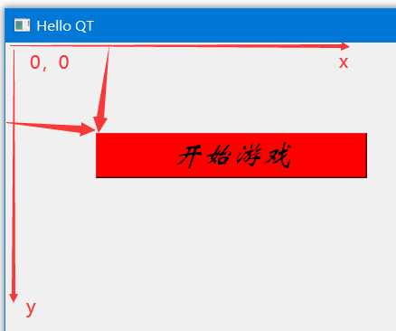

# 风骚程序员 QT 课堂笔记

## 01.创建第一个QT项目

```C++

/*
QT编辑器快捷键
注释  CTRL+/
运行  CTRL+r
构建  CTRL+b
转到定义/声明切换 F2
返回  LALT + ←
前进  LALT + →
*/

int main(int argc, char *argv[])
{
    QApplication a(argc, argv);
    //定义应用程序对象
    Widget w;
    //定义空窗口对象
    w.show();
    //调用空窗口的子函数，显示窗口
    return a.exec();
    //调用应用程序对象 消息循环函数
}

#include <QWidget>//包含Qt空窗口头文件

class Widget : public QWidget
{
    Q_OBJECT//支持信号 和 槽

public:
    Widget(QWidget *parent = nullptr);//构造函数
    ~Widget();//析构函数
    this->show();
};

this->setWindowTitle("Hello QT");   //设置窗口标题
this->resize(400,800);              //设置窗口大小
this->setFixedSize(200,200);        //固定窗口大小
```

## 02.按钮相关接口，对象树概念

### 02.1 按钮相关接口

```c++
    //创建按钮
    QPushButton* btn = new QPushButton;
    btn->resize(300,50);//设置大小
    btn->setParent(this);//设置父亲，有了这句，可以不需要手动释放了
    btn->setText("开始游戏");//设置文本
    QFont font("华文新魏",20,10,1);//创建字体对象(字体，大小，加粗，倾斜)
    btn->setFont(font);//设置字体
    btn->move(100,100);//设置按钮位置，以左上角（不包括上面的框）为原点，向下向右延伸
    btn->show();//显示按钮，放在最后

    //了解 ---> Qt支持CS4语法
    btn->setStyleSheet("QPushButton{ background-color:red;}\
                        QPushButton:hover{ background-color:green;}\
                        QPushButton:pressed{ background-color:rgba(100,155,113,1);}");
```
### 02.3 窗口坐标




### 02.2 对象树

```C++
    //生成新类，继承自QWidget

	//在主窗口中

	Student *stu = new Student;
    //现在是不能释放stu对象的
    Student *stu1 = new Student;
    stu1->setParent(this);
    //设置父亲为本窗口，当本窗口释放时，会先释放子对象
    //建立好了对象树，现在可以自动释放了
```

